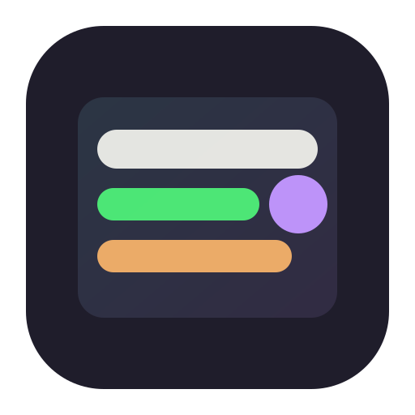

<div align="center">
  

  # 💼 Job Tracker PWA

  <p>
    <b>Offline-fähige</b> Bewerbungs- und Planer-App (React + Vite + TypeScript) — <b>ohne Backend</b>, <b>ohne Cloud</b> – alles bleibt lokal. 🔒
  </p>

  <p>
    
    
    
    
    
    
    
  </p>
</div>

---

## 🧭 Inhaltsverzeichnis

- [✨ Features](#features)
- [📲 PWA-Installation & Browser-Unterstützung](#pwa)
- [🚀 Quickstart (Dev/Build/Preview)](#quickstart)
- [🧪 Tests](#tests)
- [🧩 Technologien](#tech)
- [🗂️ Projektstruktur](#structure)
- [🧠 Architektur & Logik](#architecture)
- [🧾 Lizenz & Credits](#license)

---

<a id="features"></a>
## ✨ Features

- 📴 **Offline-First**: läuft ohne Internet (Service Worker + Offline-Seite)
- 🧠 **Lokal gespeichert**: IndexedDB (Fallback: `localStorage`) — keine Server, keine Accounts
- 🗃️ **Job-Tracker (CRUD)**: Anlegen, Bearbeiten, Löschen, Statuswechsel
- 🔎 **Suche, Filter, Sortierung**: schnell finden statt zu scrollen
- 🗓️ **Planer**: Aufgaben/Termine pro Bewerbung + Ansichten (Heute / Diese Woche / Überfällig)
- ⏰ **Follow-ups**: Fälligkeitslogik + Dashboard-Übersicht
- 🧾 **Backup & Restore**: JSON-Export mit Versionierung
- 🖨️ **PDF / Drucken**: druckoptimierte Tabellenansicht mit Statusfarben
- 🌙 **Dark/Light**: Dark Mode im **Dracula-Style** 🧛‍♂️
- 🧪 **Tests**: Vitest + Testing Library (Logik, Storage, grundlegende UI-Tests)

---

<a id="pwa"></a>
## 📲 PWA-Installation & Browser-Unterstützung

**Wichtiger Hinweis (Stand: Februar 2026):** Installierbarkeit als PWA hängt stark vom Browser ab.

### 🖥️ Desktop (Windows/macOS/Linux)

✅ **Unterstützt**
- 🟦 Chromium-Browser (Chrome, Edge, Brave, Opera)
- 🧭 Safari auf macOS Sonoma (Safari 17+) über **„Add to Dock“**

❌ **Nicht unterstützt**
- 🦊 Firefox (keine Manifest-Installation am Desktop)

### 🤖 Android

✅ **Unterstützt**
- 🟦 Chrome, Edge
- 🦊 Firefox
- 🅾️ Opera
- 📱 Samsung Internet

### 🍎 iOS / iPadOS

✅ **Unterstützt**
- iOS 16.3 und früher: **nur Safari**
- iOS 16.4 und später: Safari, Chrome, Edge, Firefox, Orion (über Teilen-Menü)

💡 **Tipp:** Der Install-Button in der App erscheint nur, wenn der Browser den Install-Prompt unterstützt (meist Chromium).  
Auf iOS nutzt du: **Teilen → Zum Home-Bildschirm**.

---

<a id="quickstart"></a>
## 🚀 Quickstart (Dev/Build/Preview)

### ✅ Voraussetzungen

- 🟩 Node.js **>=22.12.0** erforderlich
- 📦 npm **10+**

### 📥 Installation

```bash
# optional, falls nvm genutzt wird
nvm use
npm install
```

### 🧑‍💻 Entwicklung

```bash
npm run dev
```

### 🏗️ Build + Preview

```bash
npm run build
npm run preview
```

---

<a id="tests"></a>
## 🧪 Tests

```bash
npm run test
```

---

<a id="tech"></a>
## 🧩 Technologien

- ⚛️ **React 18 + Vite**: schnelle Entwicklung und moderne Build-Pipeline
- 🟦 **TypeScript**: robuste Domänenmodelle, weniger Laufzeitfehler
- 🌬️ **Tailwind CSS**: konsistentes UI-Design + Theme-Variablen
- 🐻 **Zustand**: schlanker globaler State inkl. Hydration und Auto-Save
- 🗄️ **IndexedDB** (Fallback `localStorage`): Offline-Speicherung
- 🎞️ **Framer Motion**: sanfte Animationen für Listen und Übergänge
- 🖨️ **react-to-print**: PDF-/Druckansicht direkt aus React
- 🧪 **Vitest + Testing Library**: Unit- und grundlegende UI-Tests

---

<a id="structure"></a>
## 🗂️ Projektstruktur

```
public/
 ├─ icon.svg
 ├─ manifest.webmanifest
 ├─ offline.html
 └─ sw.js
src/
 ├─ components/
 │   ├─ ApplicationCard.tsx
 │   ├─ ApplicationForm.tsx
 │   ├─ ApplicationList.tsx
 │   ├─ Dashboard.tsx
 │   ├─ FiltersBar.tsx
 │   ├─ Planner.tsx
 │   ├─ PrintView.tsx
 │   ├─ Skeleton.tsx
 │   └─ StatusBadge.tsx
 ├─ services/
 │   ├─ export.ts
 │   ├─ logic.ts
 │   ├─ storage.ts
 │   └─ theme.ts
 ├─ store/
 │   └─ appStore.ts
 ├─ tests/
 │   ├─ export.test.ts
 │   ├─ logic.test.ts
 │   ├─ setup.ts
 │   ├─ storage.test.ts
 │   └─ ui.test.tsx
 ├─ App.tsx
 ├─ index.css
 ├─ main.tsx
 ├─ types.ts
 └─ vite-env.d.ts
```

### 🔍 Ordnerstruktur im Detail

- 🧰 `public/`: PWA-Assets (Manifest, Service Worker, Offline-HTML, Icon)
- 🧱 `src/components/`: UI-Bausteine (Formular, Karten, Filter, Dashboard, Planer, PrintView)
- 🧠 `src/services/`: Domänenlogik & Infrastruktur (Storage, Export, Theme) — **UI-unabhängig**
- 🐻 `src/store/`: Zustand-Store (Aktionen, Auto-Save, Hydration)
- 🧪 `src/tests/`: Unit-/UI-Tests für Kernfunktionen
- 🧾 `src/types.ts`: Domänenmodelle (`JobApplication`, `Task`, `Settings`, `BackupFile`)

---

<a id="architecture"></a>
## 🧠 Architektur & Logik

### 🧾 Domänenmodelle (`src/types.ts`)

- 💼 **JobApplication**: Bewerbungen inkl. Status, Follow-up, Kontakt, Notizen
- ✅ **Task**: Aufgaben/Termine je Bewerbung (inkl. `done` + optional `dueDate`)
- ⚙️ **Settings**: Theme, Filter, Sortierung, Suche (persistiert)
- 🧳 **BackupFile**: JSON mit `version` + `createdAt` (für Restore/Migration vorbereitet)

### 🧪 Logik-Schicht (`src/services/logic.ts`)

Reine, testbare Funktionen (UI-unabhängig):

- 🧩 **CRUD & Statuswechsel**: `addApplication`, `updateApplication`, `deleteApplication`, `changeStatus`
- ⏳ **Follow-up**: `calculateFollowUpDate` (automatisches Follow-up, wenn sinnvoll)
- 🔎 **Filter/Sort**: `filterApplications`, `sortApplications`
- 📊 **Dashboard**: `getDashboardStats` (Verteilung, Verlauf, fällige Follow-ups)
- 🧾 **Backup & Restore**: `buildBackup`, `restoreBackup`

### 🗄️ Storage (`src/services/storage.ts`)

- 🥇 IndexedDB-first, Fallback auf `localStorage`
- 🧼 Einheitliche API: `load`, `save`, `clear`
- 🧯 Fehlerrobust durch `try/catch`

### 🐻 Store (`src/store/appStore.ts`)

- 🧠 Zentraler Zustand + Aktionen
- 💾 Auto-Save mit kurzem Debounce (250ms)
- 🧩 `hydrate` lädt Daten & setzt Theme

### 🖨️ Print/Export (`src/services/export.ts` + `PrintView`)

- 📋 `buildExportRows` erstellt tabellarische Exportdaten
- 🎨 `PrintView` rendert Druckansicht inkl. Statusfarben

### 🎨 Theme (`src/services/theme.ts`)

- 🏷️ Theme via `data-theme`
- 💡 Persistenter Dark-/Light-Toggle

---

<a id="license"></a>
## 🧾 Lizenz & Credits

- 🪪 Lizenz: **MIT** (siehe `LICENSE`)
- 👤 Autor: **Dimitri B**
- 🤖 Mit Unterstützung von **Codex-Agenten**
- 🌐 Repository: https://github.com/Web-Developer-DB/Job-Tracker
